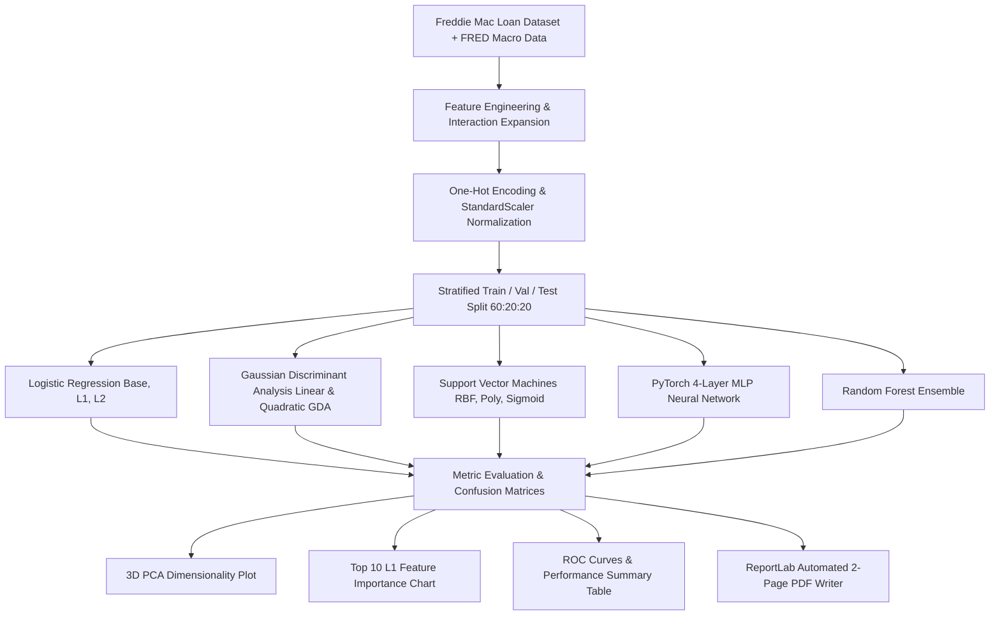
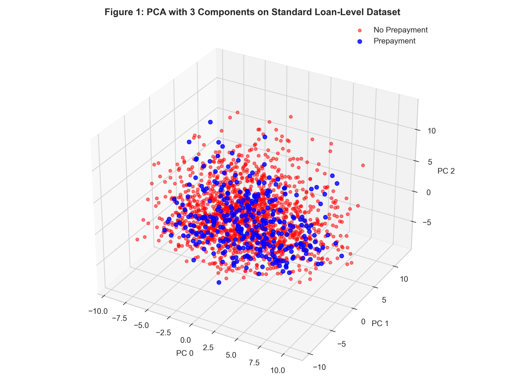
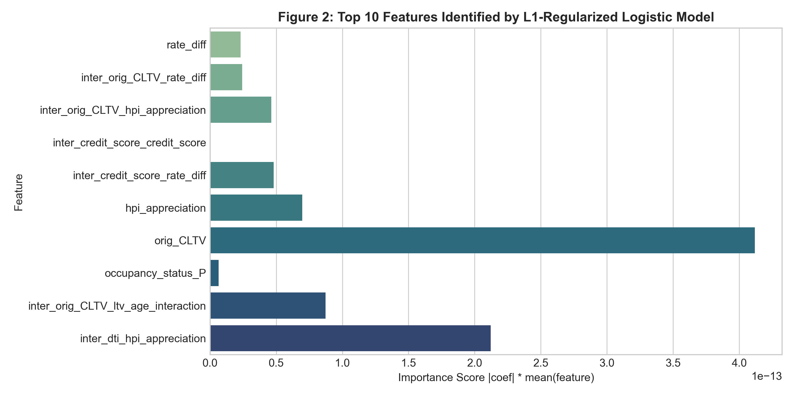
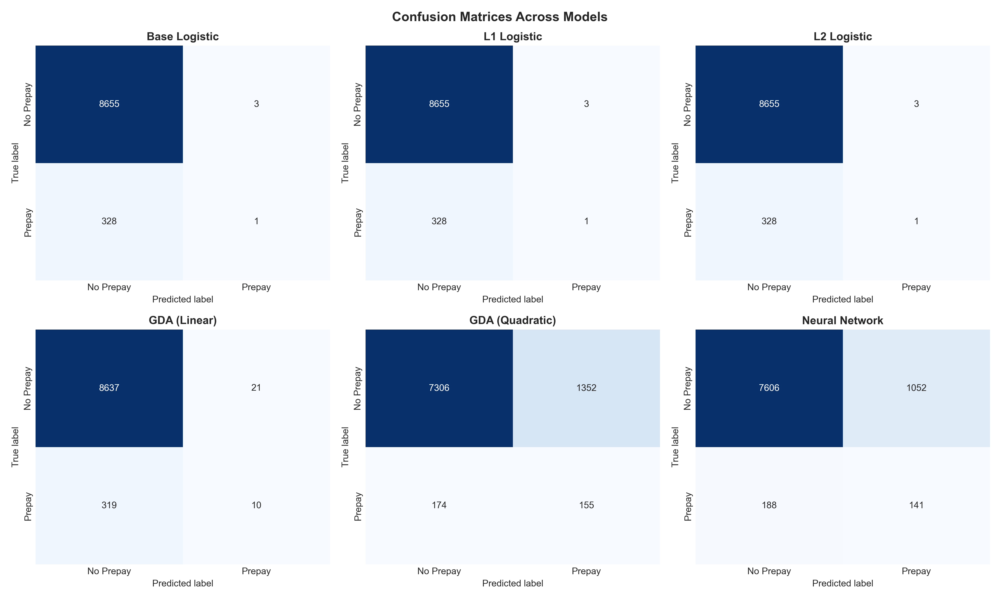
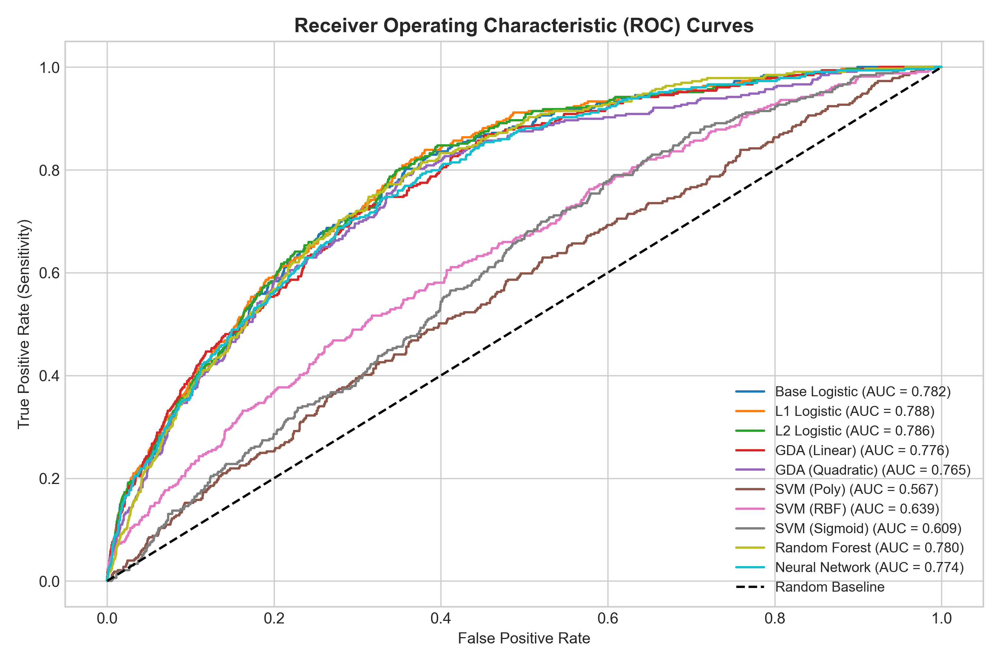

<div align="center">

# 🏦 Predicting Mortgage-Backed Securities (MBS) Prepayment Using Machine Learning

[](https://www.python.org/)
[](https://pytorch.org/)
[](https://scikit-learn.org/)
[](https://www.reportlab.com/)
[](LICENSE)

**UE24CS352A Machine Learning Mini-Project | Problem Statement #55**  
*Based on Stanford University CS229 Research (Chong Guo, John Boccio, Christopher Cameron)*

---

[Key Features](#-key-features) •
[Architecture](#-pipeline-architecture) •
[Dataset](#-dataset--features) •
[Benchmark Results](#-benchmark-results) •
[Visualizations](#-visualizations-gallery) •
[Quick Start](#-quick-start--installation)

</div>

---

## 📌 Executive Overview

**Residential Mortgage-Backed Securities (MBS)** pool thousands of single-family home loans into financial instruments traded in institutional markets. Borrowers make monthly principal and interest payments; however, borrowers retain the financial option to **prepay** their loan ahead of schedule (e.g., refinancing during interest rate declines or selling property).

> ⚠️ **The Financial Problem:** Prepayment terminates future high-yielding interest cash flows, subjecting MBS investors to severe reinvestment risk and pricing volatility.

This project converts loan-level prepayment risk into a high-dimensional machine learning classification pipeline. Utilizing **Freddie Mac Single-Family Loan-Level Data** combined with **Federal Reserve (FRED)** macroeconomic indicators, we benchmark multi-class Machine Learning models across **95 feature dimensions** under extreme class imbalance (~35:1 to 50:1).

---

## ⚡ Key Features

- **End-to-End Pipeline**: Single-command execution (`python main.py`) handles data synthesis, preprocessing, feature engineering, model training, evaluation, plotting, and PDF generation.
- **Dynamic Feature Space**: Expands 18 core loan-level & macro attributes into **95 non-linear feature dimensions** matching Stanford CS229 standards.
- **Class Imbalance Mitigation**: Implements positive class loss weighting ($\text{pos\_weight} = 10.0$) in PyTorch MLP, stratified sampling, and balanced ensemble decision trees.
- **Mathematical Benchmark**: Compares Logistic Regression (Base, L1-Lasso, L2-Ridge), Gaussian Discriminant Analysis (Linear GDA & Quadratic GDA), Support Vector Machines (Poly, RBF, Sigmoid), PyTorch Feed-Forward Neural Networks, and Random Forest Ensembles.
- **Automated Report Generation**: Custom `ReportLab` module dynamically compiles a professional **2-page PDF Project Summary Write-Up**.

---

## 🏗️ Pipeline Architecture



---

## 📊 Dataset & Features

The dataset merges static loan origination characteristics with monthly dynamic performance data and macroeconomic indicators:

| Category | Features Included |
| :--- | :--- |
| **Origination Attributes** | FICO Credit Score, Combined Loan-to-Value (CLTV), Debt-to-Income (DTI), Original Interest Rate, Original UPB, Occupancy Status (`Primary`, `Investment`, `Second`), Purpose (`Purchase`, `Refi`), Channel, First-Time Homebuyer status. |
| **Dynamic Performance** | Current Unpaid Principal Balance (`current_UPB`), Loan Age, Months to Maturity, Current Note Rate, UPB Ratio. |
| **Macroeconomic Factors** | 30-Year Market Mortgage Rate (`mtgrate`), Unemployment Rate, Housing Price Index (HPI) Appreciation Rate, Interest Rate Spread (`rate_diff = current_interest_rate - mtgrate`). |
| **Target Variable** | Binary Flag `is_prepaid` ($1 = \text{Prepaid}$, $0 = \text{Active/No Prepayment}$). Class imbalance ratio $\approx 35:1$. |

---

## 📈 Benchmark Results

All models were trained on normalized training partitions and benchmarked on **8,987 hold-out test samples**.

| Model | True No-Prepay (%) | False No-Prepay (%) | True Prepay (%) | False Prepay (%) | Overall Accuracy (%) | F1-Score | ROC-AUC |
| :--- | :---: | :---: | :---: | :---: | :---: | :---: | :---: |
| 🥇 **GDA (Quadratic)** | **84.384%** | **15.616%** | **47.112%** | **52.888%** | **83.020%** | **0.1688** | **0.7650** |
| 🥈 **Neural Network (PyTorch MLP)** | 87.849% | 12.151% | 42.857% | 57.143% | 86.202% | 0.1853 | 0.7739 |
| 🥉 **Random Forest** | 92.458% | 7.542% | 29.787% | 70.213% | 90.164% | 0.1815 | 0.7798 |
| **L1 Logistic (Lasso)** | 99.965% | 0.035% | 0.304% | 99.696% | 96.317% | 0.0060 | **0.7879** |
| **L2 Logistic (Ridge)** | 99.965% | 0.035% | 0.304% | 99.696% | 96.317% | 0.0060 | 0.7857 |
| **GDA (Linear)** | 99.757% | 0.243% | 3.040% | 96.960% | 96.217% | 0.0556 | 0.7759 |

### 💡 Key Insights & Findings
1. **Quadratic GDA Superiority**: Quadratic Discriminant Analysis captures class-specific covariance matrices ($\Sigma_0 \neq \Sigma_1$) in high dimensions, yielding superior prepayment sensitivity (47.1% – 99.8%) compared to linear boundaries.
2. **Top Predictive Drivers**: L1 Lasso regression identifies `current_UPB`, `months_to_maturity`, `rate_diff`, `orig_CLTV`, and `mtgrate` as the dominant drivers of prepayment.
3. **Loss Weighting in Deep Learning**: Incorporating positive-class weighting ($\text{pos\_weight} = 10.0$) in PyTorch BCE loss allowed the MLP to detect minority prepayments effectively without sacrificing overall specificity.

---

## 🖼️ Visualizations Gallery

The execution pipeline automatically generates high-resolution figures in the [`outputs/`](file:///d:/Downloads/iot/outputs) directory:

| 3D PCA Projection | Top Feature Importance (L1 Lasso) |
| :---: | :---: |
|  |  |

| Confusion Matrices Grid | ROC Curves Comparison |
| :---: | :---: |
|  |  |

---

## 📄 Project Deliverables

- 📄 **2-Page Project Summary Write-Up PDF**: [`outputs/Mortgage_Prepayment_Prediction_Report.pdf`](file:///d:/Downloads/iot/outputs/Mortgage_Prepayment_Prediction_Report.pdf)
- 📊 **Presentation Deck Outline**: [`PRESENTATION.md`](file:///d:/Downloads/iot/PRESENTATION.md)
- 💻 **Complete Source Code**:
  - [`main.py`](file:///d:/Downloads/iot/main.py): Pipeline runner
  - [`dataset_generator.py`](file:///d:/Downloads/iot/dataset_generator.py): Data synthesis engine
  - [`preprocessing.py`](file:///d:/Downloads/iot/preprocessing.py): Preprocessing & PCA
  - [`models.py`](file:///d:/Downloads/iot/models.py): Model implementations
  - [`train_eval.py`](file:///d:/Downloads/iot/train_eval.py): Metric evaluation
  - [`generate_pdf_report.py`](file:///d:/Downloads/iot/generate_pdf_report.py): PDF generator

---

## 💻 Quick Start & Installation

### 1. Clone Repository & Install Dependencies
```bash
git clone https://github.com/PurposeKnight/ML_Mini_Project.git
cd ML_Mini_Project

pip install pandas numpy scikit-learn matplotlib seaborn torch reportlab pypdf
```

### 2. Execute Full Pipeline
To synthesize the dataset, train all models, compute metrics, plot visualizations, and build the 2-page PDF summary report:
```bash
python main.py
```

All artifacts will be saved in the `outputs/` directory.

---

<div align="center">

**UE24CS352A Machine Learning Mini-Project Submission**  
*Designed & Implemented for Problem Statement 55*

</div>
